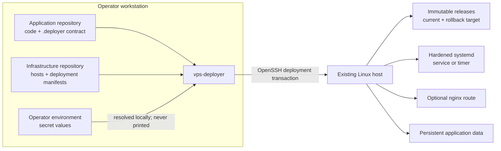

# vps-deployer

Deploy ordinary Linux services to a host with the operational properties of a
small PaaS, without Docker or a resident agent.

`vps-deployer` packages a release locally, transfers it over OpenSSH, installs it
immutably, manages a hardened systemd service or timer, checks health, optionally
reconciles an nginx route, and rolls back failed activation. It targets operators
running roughly one to a dozen independent services on a normal Linux host.

It is deliberately:

- not configuration management;
- not a container runtime;
- not a build system;
- not a multi-host rollout orchestrator.

Applications arrive as prepared artifacts with an executable `.deployer/run.sh`.
Host packages, firewalls, TLS issuance, databases, DNS, kernel settings, and
unrelated users remain owned by host administration. The core product boundary
is a single-host deployment transaction.



## When it fits

Use it for self-contained HTTP services, workers, bots, webhooks, and scheduled
jobs that naturally run under systemd. Go/Rust binaries, packaged Java runtimes,
prepared Node/Python artifacts, and small native daemons fit especially well.

Prefer another tool for container-image-first software, multi-service products,
host provisioning, or coordinated fleet rollouts. Compared with Docker Compose,
the application runtime stays Linux-native while the deployment lifecycle is
managed. Compared with Ansible, vps-deployer owns application releases rather
than general machine state.

## Installation

Python 3.10 or newer and an OpenSSH client are required on the operator machine.
Install from a checkout into an isolated environment:

```console
git clone https://github.com/anfit/vps-deployer.git
cd vps-deployer
python -m venv .venv
.venv/Scripts/python -m pip install .
.venv/Scripts/vps-deployer --version
```

On Linux or macOS, use `.venv/bin/python` and `.venv/bin/vps-deployer`.
The target host requirements are checked by `host inspect` and deployment
expectations; see the operations guide before onboarding a host.

Detailed documentation:

- [`docs/build-properties.md`](docs/build-properties.md) — application-visible build and deployment provenance contract.
- [`docs/expectations.md`](docs/expectations.md) — read-only application and infrastructure host contracts.
- [`docs/architecture.md`](docs/architecture.md) — ownership model and remote layout.
- [`docs/manifest-reference.md`](docs/manifest-reference.md) — complete host and deployment schema.
- [`docs/operations.md`](docs/operations.md) — onboarding, deployment, status, rollback, removal, and troubleshooting.

## Codex skills

Codex discovers two repository-scoped operational skills under `.agents/skills`:

- `operate-vps-deployments` plans, applies, verifies, diagnoses, rolls back, and removes existing managed deployments.
- `onboard-vps-service` adapts a new or legacy service and adds its desired state to `service-infra`.

Invoke them explicitly as `$operate-vps-deployments` or `$onboard-vps-service`, or describe a matching task while working anywhere in this repository.

## Repository layout

Keep host identity separate from application deployment identity. Deployment
files may be grouped recursively by application:

```text
infra/
  hosts/
    prod.yaml
  deployments/
    invoicer/
      prod.yaml
  globals/                 # optional; only genuinely shared non-secret values
  artifacts/               # optional local release inputs
```

See [`examples/hosts/prod.yaml`](examples/hosts/prod.yaml) and
[`examples/deployments/invoicer/prod.yaml`](examples/deployments/invoicer/prod.yaml).
Ordinary configuration should be committed directly in a deployment. Use
`from_global` only for values intentionally shared by multiple deployments, and
use `secrets.from_env` only for secret material.

Multiple deployments may target the same host. An optional `http_proxy` block
manages a deployment's nginx site, TLS certificate references, loopback upstream,
configuration validation, and reload independently from other routes on that host.

The application repository owns `.deployer/` and application provenance. The
infrastructure repository owns deployment identity, runtime configuration,
routing, storage, and secret references. Secret values remain in the operator
environment; persistent application data remains on the host.

Local artifact and include paths support explicit `${NAME}` environment roots.
Unresolved variables and `..` traversal are rejected. For example:

```yaml
release:
  source: ${PROJECTS_DIR}/my-service
  include:
    - source: ${SERVICE_INFRA_DIR}/configs/my-service/prod.yaml
      target: config/production.yaml
```

Directory artifacts may contain a `.deployer/ignore.txt` file with gitignore-like
glob patterns. Matching developer-local files are excluded from both the release
hash and uploaded archive; use it to prevent local credentials and helper files
from entering managed releases. `.vps-deployer-ignore` remains a compatibility
fallback for applications that have not migrated.

Applications expose their managed runtime through `.deployer/run.sh`. This is the
default `runtime.command`, so ordinary infrastructure manifests need not repeat
an application-owned path. Named entrypoints such as `.deployer/bootstrap.sh` may
be selected explicitly for a distinct service lifecycle.

Every release contains an application-facing `build.properties` file. Existing
application/build properties are preserved and vps-deployer appends reserved
`deployment.*` provenance without modifying the checkout. `status` checks the
active deployment provenance against the desired release and commit; stale or
missing metadata makes the deployment unhealthy. After a successful activation,
the active release and its immediate predecessor are retained for rollback; older
release directories are pruned. Failed deployments do not trigger cleanup.

## Commands

```console
vps-deployer --version
vps-deployer validate
vps-deployer check DEPLOYMENT
vps-deployer host inspect HOST
vps-deployer host onboard HOST
vps-deployer plan DEPLOYMENT
vps-deployer apply DEPLOYMENT
vps-deployer status DEPLOYMENT
vps-deployer logs DEPLOYMENT
vps-deployer rollback DEPLOYMENT
vps-deployer remove DEPLOYMENT
```

Run from the infra repository, or select it explicitly:

```console
vps-deployer --repo ./examples validate
vps-deployer --repo ./examples plan invoicer-prod
```

`remove` stops and disables a deployment and removes its systemd unit and
environment file. It deliberately retains releases, writable storage, and service
users. Privileged deployments require `--allow-privileged` for both apply and
removal.

Hosts may set `ssh.privileged_host`, `ssh.privileged_user`, and
`ssh.privileged_identity_file` to route privileged operations through a separate
SSH identity. Use `tools/vps-deployer-ssh-gate` as that key's server-side forced
command so it cannot open an interactive root shell. The forced command must
declare the host's managed root and each storage path assigned to this key:

```text
command="/usr/local/sbin/vps-deployer-ssh-gate --managed-root /srv/vps-deployer --storage /var/lib/example" ssh-ed25519 AAAA...
```

The client sends named capability requests; the gate constructs fixed executable
arguments and rejects storage outside this policy. Update the forced-command
installation before using a client containing this protocol change.

Systemd units use a separate validated gate capability rather than opaque file
writes. The gate accepts only the hardened non-root unit structure rooted in the
deployment's active release and allowlisted storage. A restricted-key host cannot
apply `service.privileged: true`; root services require a separately trusted sudo
or host administration path.

Secrets are accepted only through explicitly declared process-environment
references and are never printed by planning or validation.

## Versioning and compatibility

Version 1.0 establishes the stable public contracts for deployment manifests,
the `.deployer/` application interface, generated `build.properties`, CLI
commands, and the restricted SSH gate protocol. Compatible additions are made
within the 1.x series; incompatible contract changes require a new major
version and explicit migration documentation.

The client and server-side SSH gate are one security-sensitive protocol pair.
When release notes identify a gate protocol change, install the matching gate
before using the new client against a restricted-key host.

## License

The complete `vps-deployer` codebase, including versions from project inception,
is licensed by Jan Chimiak under the [Business Source License 1.1](LICENSE).
Production use is permitted except for paid hosted or embedded competitive
offerings. Each version converts to MPL 2.0 four years after its first public
distribution.
