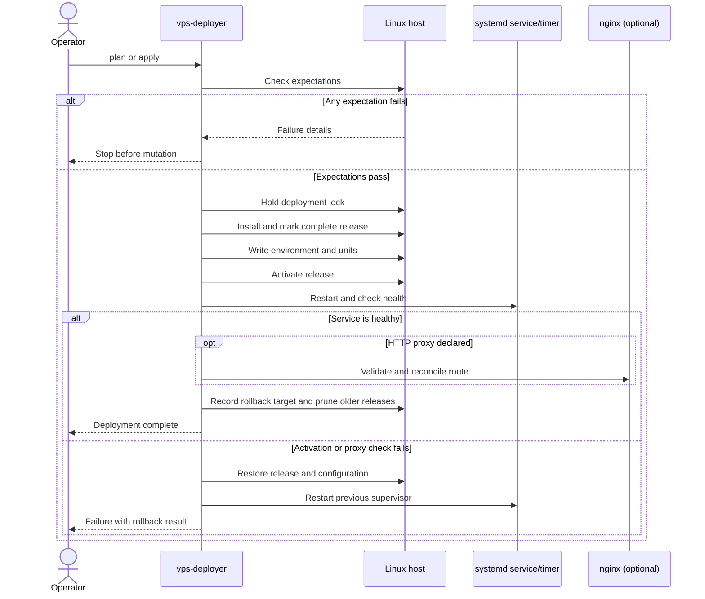

# Architecture

`vps-deployer` reconciles committed desired state from an infrastructure
repository with Linux hosts reachable through OpenSSH. Application repositories
contain code; the infrastructure repository contains deployment identity,
runtime configuration, routing, storage, and secret references.

## Scope boundary

The unit of coordination is one deployment transaction on one host. Independent
deployments may run concurrently, but there is no fleet rollout, canary, quorum,
or cross-host rollback model.

The project deploys applications; it does not configure Linux machines. Package
installation, firewalls, generic templates or hooks, databases, DNS, certificate
issuance, kernel configuration, SSH configuration, and cloud APIs are explicit
non-goals. Host assumptions may be inspected and rejected, but never remediated.

## Ownership boundaries

- The application repository owns executable code and the `.deployer/` integration contract.
- The infrastructure repository owns hosts and deployment manifests.
- The operator environment owns secret values and local repository roots.
- The remote host owns persistent runtime data, TLS keys, and the retained rollback release.
- `vps-deployer` owns generated systemd units, environment files, release trees,
  active-release symlinks, and declared nginx sites.

One host may run any number of isolated deployments. A deployment name is the
stable identity used for its systemd unit, release directory, environment file,
and optional nginx route. Deployments on the same host must use distinct names,
loopback ports, storage paths, and proxy names.

## Remote layout

For deployment `example-prod` under the default managed root:

```text
/srv/vps-deployer/example-prod/
  releases/<release-id>/
  current -> releases/<release-id>
  previous -> releases/<release-id>
/etc/vps-deployer/example-prod.env
/etc/vps-deployer/example-prod.state
/etc/systemd/system/vps-deployer-example-prod.service
/etc/nginx/sites-available/<proxy-name>      # when http_proxy is declared
/etc/nginx/sites-enabled/<proxy-name>
```

Writable application state belongs outside releases, normally below `/var/lib`.
Releases are immutable and owned by root with read/execute access for the service
user. `remove` intentionally retains releases, storage, and service users.

Runtime dependencies should preserve the same rollback boundary as application
code. Prefer a complete prepared artifact, a dependency environment keyed by its
content hash, or a release-associated environment. A single mutable virtualenv
shared by unrelated releases can make rollback restore old code against new
dependencies and should be avoided.

## Release identity and manifest

Release IDs are source-state-addressed. The hash covers deployable source files,
release includes, and the Git commit when the source is versioned, so identical
deployable bytes from different commits intentionally produce different IDs. Ignored local
files and `.git` do not enter the archive.

Every installed release receives deployment provenance in the separate,
application-facing [`build.properties` contract](build-properties.md). Existing
application/build fields are preserved:

```properties
deployment.release=4d9901a72c81e240
deployment.commit=<full Git SHA>
deployment.commit-time=<ISO-8601 commit time>
deployment.timestamp=<UTC deployment time>
deployment.branch=<checked-out branch>
deployment.actor=vps-deployer
```

For unversioned artifacts, commit fields are omitted and the branch is
`unversioned`. `status` checks `deployment.release` and, when available,
`deployment.commit`.
A running service with a missing or stale manifest is reported unhealthy.

Release installation finishes by writing a root-owned `.release-complete` marker
only after extraction, ownership, permissions, provenance, and runtime entrypoint
setup succeed. Directory existence alone never makes a release installable. An
inactive directory without the marker is removed and rebuilt on the next apply.
For migration, a healthy active release with matching provenance can receive the
marker without reinstallation; an incomplete unhealthy active release is rejected
for explicit operator recovery rather than deleted under a running service.

## Apply and rollback



An apply uploads a new release only when its completion marker is absent. It writes the
environment and unit, activates the new symlink, restarts the service, and runs
the health check. If activation fails, the former environment, service and timer
units are restored along with `current` before the previous service is restarted.
An unhealthy first deployment is stopped and reported as failed. After a successful activation,
the former active release is recorded explicitly by the `previous` symlink. After the complete deployment
succeeds, older releases are deleted; only the active release and its immediate
predecessor remain. Cleanup never runs after a failed activation.

Apply holds a non-blocking host lock at
`/run/lock/vps-deployer-<deployment>.lock` across the complete multi-command
transaction. Concurrent applies for the same deployment fail without mutating
state; independent deployments remain parallelizable.

Nginx changes are serialized under a host-wide deployer lock. A candidate site is
temporarily enabled and validated before it atomically replaces the managed site;
failed validation restores the former enabled site and triggers application
rollback. Each deployment reconciles only its owned proxy file.

Scheduled deployments add a systemd `.timer` beside a sandboxed oneshot service.
The timer, rather than the short-lived service, is enabled and used for health
and lifecycle operations.

The state file records optional resources owned by the deployment. A later apply
reconciles absence as desired state: obsolete timers and nginx sites are disabled
and removed, and service/timer mode transitions disable the former supervisor
after the replacement is healthy.

Deployments created by clients predating the state file require a one-time
adoption apply with their existing optional resources still declared. This
records ownership before a subsequent manifest removes or renames those
resources; see the operations guide.

## Privilege model

Normal SSH access is used for inspection and unprivileged commands. Root-owned
files and systemd operations use either the host account's scoped sudo access or
a separate privileged SSH identity. A privileged identity should be restricted
server-side with `tools/vps-deployer-ssh-gate`; it must not provide a general
interactive root shell. The client sends operation names rather than executable
names. The gate constructs fixed commands for those capabilities and is installed
with an explicit managed root and allowlisted storage paths, so the key cannot
operate on unrelated state elsewhere under `/var/lib`. Root-owned configuration
is streamed to an atomic `write-file` capability; secret content is never staged
at an unprivileged or shared temporary pathname.

The forced-command gate does not accept opaque systemd unit contents through its
general file writer. Managed service and timer files use a distinct capability;
the gate validates the complete hardened structure, requires a matching non-root
service identity, confines `WorkingDirectory` and `ExecStart` to that deployment's
active release, and checks every writable path against the key's storage policy
before writing atomically. Thus the restricted key cannot turn a unit write plus
`systemctl restart` into arbitrary root execution. Deployments intentionally
running as root are outside this restricted-key threat model and require a
separately trusted privilege path.

## Trust model

The local operator and application source are trusted to choose code executed as
the declared non-root service identity. Secret environment values are trusted
inputs and are written only to the deployment's root-owned environment file.

The ordinary SSH account is trusted to upload the exact artifact selected by the
operator. Archives are validated locally and restricted again during privileged
extraction, but the upload currently crosses that account's `/tmp`; compromise of
the ordinary account can replace deployable code and is therefore equivalent to
compromise of the application release, though not intended to grant root access.

The optional privileged key has a narrower boundary: it must not provide an
interactive shell or arbitrary root execution. Its forced-command gate is a
security-sensitive protocol and is intentionally kept to deployment-specific
capabilities. New features that cannot fit that model should be rejected rather
than generalized. Lexical path validation is supplemented by root ownership,
atomic writes, link/type restrictions, and archive rejection; symlink and race
behavior remains a primary adversarial testing target.

## Testing priorities

Unit tests protect schema, rendering, transaction decisions, and gate policy.
The next maturity layer is disposable-host end-to-end and fault-injection testing:
failed releases and nginx reloads, service/timer transitions, interrupted SSH,
process termination around activation, disk exhaustion, reboot recovery,
malicious archives and symlinks, and concurrent deployments. These tests are more
valuable than broadening the manifest into additional host-management features.
